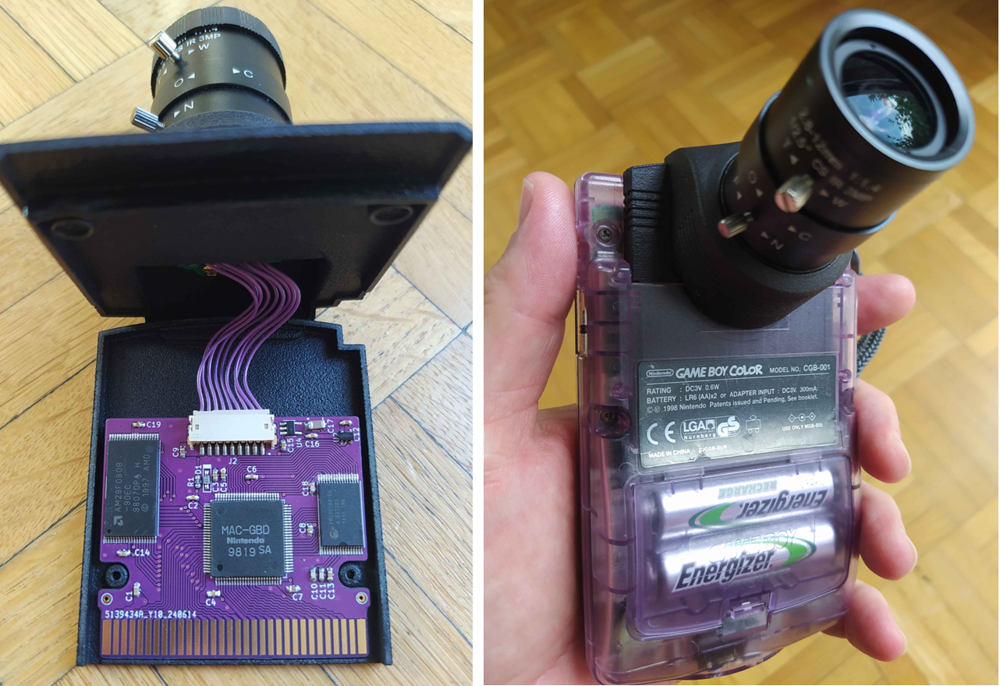
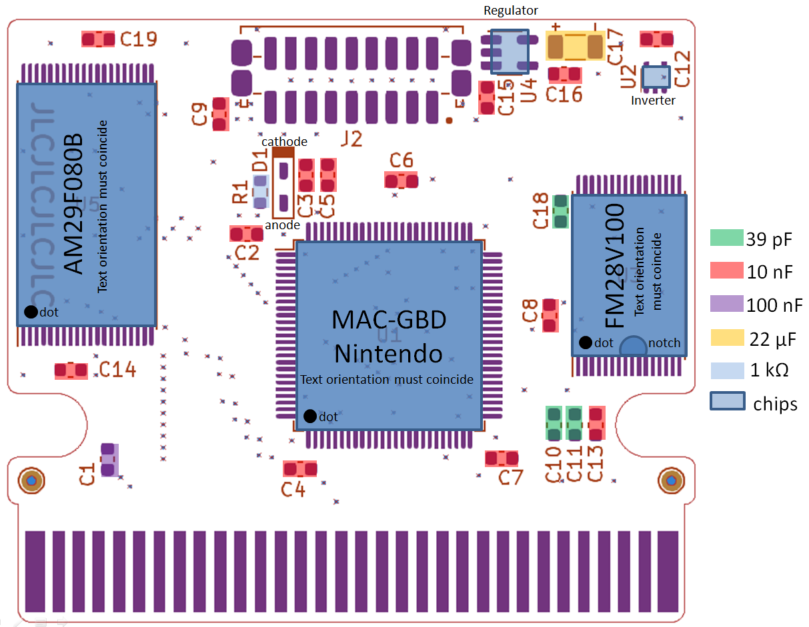
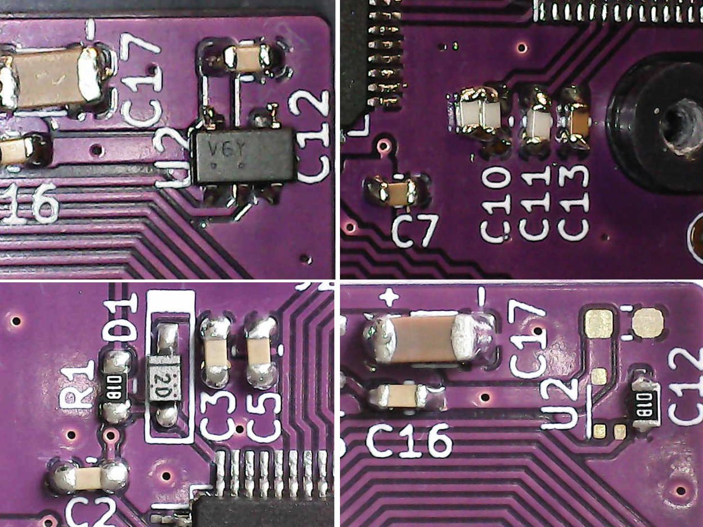

# The Game Boy Mini Flashable Camera - a fork

## ////////////People on PCBWay have fraudulently claim authorship for this project, do not give them money !!!//////////////

**A license free flashable version of the Game Boy Camera, in a small form factor. A fork I've made to render the project doable without external help. All necessary informations are here. I also propose an alternative simplier design requiring less components.**

**The license (rather the absence of it) allows you to do what you want with your mod: selling it, offering service for doing the mod, modifying it starting from the schematic, it's up to you.**

**The design was made from scratch and people involved have no hidden conflict of interest with any other similar project. We are not here for money or fame, this project is just a gift to the Game Boy modding community.**

**Isn't this gorgeous in purple ?**

The current release has been produced, assembled, tested and bullet proofed in sweat and blood. The board is compatible with any regular camera rom (Game Boy Camera, Pocket Camera, Hello Kitty, Zelda special edition and [Debagame tester](https://tcrf.net/Proto:Game_Boy_Camera)) and homebrews like [Photo!](https://github.com/untoxa/gb-photo) or [2bit PXLR Studio](https://github.com/HerrZatacke/2bit-pxlr-studio). It is recommended to flash this board with a [GBxCart](https://www.gbxcart.com/) and [FlashGBX](https://github.com/lesserkuma/FlashGBX) as support is guaranteed. FlashGBX automatically recognizes it without doing anything. Other flashing devices (GB Operator, Cyclones and other Chinese oddities) were not tested, try them by yourself. Some considerations made in this repository are just related to me being a cheap modder living in Europe and everything else being sold from US/China, so adapt the reading level to your own localization / wealth.

## Why this fork ? Isn't the main branch enough ?

In short: no. Let me explain the story first, it's interesting.

The main branch has been published by 2BitWizard with a minimalistic readme during the summer 2023. The author kindly shipped to me some pre-release boards for feedback (as well as to a bunch of other modders). 2BitWizard and I were both quite active members on some retro stuff related Discord. Unfortunately, 10 months passed before I found time/motivation to dive seriously into the project (I have no excuses, even though I've spent the year dealing with shit). Meanwhile, I lost any way to contact the author as well as the manual to assemble the pre-release boards (which were different enough from the current project to be lost in translation) after leaving progressively all social media for various good reasons.

But I still owed 2BitWizard a feedback. Because yes, I'm an old-fashioned guy with principles.

To my big surprise, the main branch stayed nearly inactive after the initial commits. Out of curiosity, I've decided to restart the mod from zero, alone with my workbench, putting aside my pre-release boards that I was unable to populate anymore. I wanted to confirm that it was possible to make the project with the only informations, gerbers and schematics provided in the main repository. I found inconsistencies. I had to seek for external help and needed cross validation (see the acknowledgements). I had to fix important things (confirmed by the original author since).

So.

I've decided to make my own fork. I like this project.

## What have been changed compared to the main branch ?

- Inconsistencies between BOM and schematic have been fixed, BOM is simplified;
- All 22 pf caps have been replaced with 39 pf to definitely fix [image artifacts](/Images/Artifacts_with_22pf_C10.png) linked to FRAM. The initial author also shifted to a higher value (33 pf) after observing the same artifacts, but to date, the main branch was not updated accordingly;
- The project now contains all necessary informations to be completed without having to cross-check datasheets and schematic and make educated guesses;
- An [alternative design](/Alternative_design) with less components and using the same PCB is also proposed.

## Minimal hardware/skill required in addition to all the BOM before starting anything

- A multimeter with at least a beeping continuity mode for troubleshooting;
- A 60W soldering iron with a fine tip and a real temperature control. This [kind of puny soldering iron](https://a.aliexpress.com/_EIEo07n) is **NOT** an option to consider unless you want to kill yourself;
- A hot air gun (ideally a reflow station) or a heating plate to desolder the MAC-GBD;
- Good quality solder wire/flux or solder paste and solder wick;
- Isopropanol in large quantities to clean all the flux mess;
- A magnifying system like an USB microscope or binocular magnifiers;
- A GBxCart flasher and FlashGBX software. Other flashers may or may not work;
- Some kapton tape (or any whatever branded polyimide tape) to cover the PCB gold fingers during soldering;
- Fine twizzers to handle the tiny components (and experience the joy of capacitor tombstoning);
- 3 hours of free time with your prefered music in background and no kids whining around;
- A good skill in soldering because **this is not a beginner project**. It can really end as a mess if you don't know what you are doing. Keep in mind that the mod is not intended to be easily reversible.

## What to fit it with

The GB mini flashable camera comes in two PCB versions that fit any kind of cool existing shells. It is meant to be as versatile as possible. **The long PCB can be turned into a short PCB by simply breaking the PCB neck so I recommend ordering only the long one as it lets you more shell options.**

The GB mini flashable camera in short version fits perfectly with the [Camera+ Mini shell](https://ko-fi.com/s/a4d7bd649a). With this shell, you can reuse the regular camera sensor ribbon. **With the short PCB, use an horizontal JST connector as clearance is very low.**

## Showcase with the short PCB in a Camera+ Mini shell

The long PCB version has a "neck" that allows mounting it in a regular Game Boy Camera or a [Game Boy Camera+ shell](https://ko-fi.com/s/9457d1cc6e) with the regular sensor ribbon as well. **The long neck must be populated with a vertical JST connector only.**

## Showcase with the long PCB in a regular (but fancy) camera shell

Atomic purple case with purple PCB, what could go wrong ? (note the missing signal inverter on purpose, [this is why](/Alternative_design)).

In case you want to mount the **short PCB** in a regular camera shell (why not after all), you will need a **longer ribbon cable**, and that's where the pain begins. 
**Aliexpress JST cables are much too thick and stiff for that task** (plus they are just crap, do not buy them) and you must order a genuine JST cable. The only known supplier for genuine cables is Digikey (with prohibitive shipping fees to Europe). Choose a [type B cable "socket to socket" ](https://www.digikey.fr/en/products/base-product/jst-sales-america-inc/455/A09ZR09Z/588181). The regular camera cable is [2 inches long](https://www.digikey.fr/en/products/detail/jst-sales-america-inc/A09ZR09ZR28H51B/6708551), so take at least a [4 inches one](https://www.digikey.fr/en/products/detail/jst-sales-america-inc/A09ZR09ZR28H102B/9972202). Digikey ribbon cables are just a bit stiffer than the genuine cables but they can sustain the same amount of bending/torsion without loosing connection, in brief they are damn good quality. Funfact: the JST male connectors from Aliexpress, in the other hand, are just perfectly OK.

Please follow the [building instructions from the original author](/Building_guides/build.pdf) (also given in next section) for PCB ordering options. Use [JLCPCB](https://passport.jlcpcb.com/) for ordering if you live in Europe. They offer VAT compliant services for European customers and very cheap shipping options. I typically got 5 boards ENIG finish shipped to France for 23€ in 2024.

**IMPORTANT note:** you can harvest the voltage regulator from **some versions** of the Game Boy Camera. They are populated either by the U4 or U5 regulator. The current board is designed to work with either the regulator linked in the BOM or the U5 regulator harvested from the original camera cart. **U4 from the original board will not work.** If you're using a new 3V0 regulator from the BOM list, the **C16 capacitor will not be necessary.** Unlike the original 3V0 regulator, the pin connected to this capacitor is not connected on the new 3V0 regulator. **I recommend anyway buying the regulator indicated in the BOM to start from fresh.**

## Component location and orientation on PCB

It's not an interactive BOM but it will do the job. If you are colorblind, please refer to the next table which is the same. **No component other than the MAC-GBD need to be harvested from the original camera PCB.** You can also take a look to my proposal of [alternative design using less components](/Alternative_design).

## Component list (BOM)

|Silkscreen |Value |# |Footprint |Exact reference |Aliexpress link |
|---------|---------|---------|---------|---------|---------|
|C1	|100nF	|1	|0603 |Capacitor Ceramic (X7R)	|[100 nf - 0603](https://fr.aliexpress.com/item/1005005690927737.html)|
|C2 to C9, C12 to C16, C19	|10nF	|14	|0603 |	Capacitor Ceramic (X7R)|[10 nf - 0603](https://fr.aliexpress.com/item/1005005690927737.html)|
|C10, C11, C18	|39pF	|3	|0603 |Capacitor Ceramic (X7R)|[39 pf - 0603](https://fr.aliexpress.com/item/1005005690927737.html)|
|C17	|22µF	|1	|1206 |Capacitor Tantalum (≤10%)	|[22 µf, 16V X7R - 1206](https://fr.aliexpress.com/item/1005006022131059.html)|
|D1	|N/A	|1	|SOD-123 |BAT54W-HG3-18 Schottky diode|[BAT54W - SOD-123](https://fr.aliexpress.com/item/1005007021313163.html)|
|J2	|N/A	|1	|N/A	|JST ZH1.5mm (9 pins)	Camera Connector (male, horizontal or vertical)|[9 pins JST connectors](https://fr.aliexpress.com/item/1005006028155508.html)|
|R1	|1kΩ	|1	|0603 |Resistor	|[1kOhm - 0603](https://fr.aliexpress.com/item/1005005677654015.html)|
|U1	|N/A	|1	|TQFP-100 |MAC-GBD gamecart mapper chip|Harvest from cart|
|U2	|N/A	|1	|SC-88A-5 |M74VHC1GU04DFT1G Signal inverter|[M74VHC1GU04DFT1G](https://fr.aliexpress.com/item/1005006984696269.html) - see notes before ordering|
|U3	|N/A	|1	|TSOP-I-32 |FM28V100-TG FRAM|[FM28V100-TG - TSOP-32](https://fr.aliexpress.com/item/1005007221226758.html)|
|U4	|N/A	|1	|SOT-23-5	|NCP718ASN300T1G 3V0 voltage regulator|[NCP718ASN300T1G - SOT-23-5](https://fr.aliexpress.com/item/1005007543804480.html)|
|U5	|N/A	|1	|TSOP-I-40 |AM29F080B	Flash memory|[AM29F080B - TSOP-40](https://fr.aliexpress.com/item/1005007324498768.html)|

The PCB was designed on purpose with "big" surface mount components only. Anything smaller than the 0603 footprint would be just sadistic for this kind of leisure project.
You can report dead Aliexpress links in the **issues**, I will update them ASAP. I did not try to optimize shipping fees here, there is maybe a cheaper combination of sellers.

## Schematic

## Overview of JLCPCB ordering options

Base Material **FR-4**, Layers **2**, Dimensions **Auto-filled**, PCB Qty **As desired**, Product type **Industrial/Consumer electronics**, Different Design **1**, Delivery format **Single PCB**,  PCB thickness **0.8**, PCB Color **As desired**, Silkscreen **As desired**, Surface Finish **ENIG**, Outer Copper weight **1 oz**, Via Covering **Tented**, Board Outline Tolerance **±0.2mm(Regular)**, Confirm Production file **No**, Remove Order Number **Specify a location**, Flying Probe Test **Fully Test**, Gold Fingers **Yes**, 30°finger chamfered **No**, Castellated Holes **No**.

## Notes (please read completely before attempting the project)

- The M74VHC1GU04DFT1G signal inverter, in particular in SC-88A package, can be tricky to source (only remaining seller is Mouser), so a solution is to switch to a MC74VHC1GU04DF1G (solution proposed by Digikey) or to another close package (like the SC−74A, only one you will receive from Aliexpress, whatever claim the sellers). **The SC-88A package is equivalent to SOT-353 or SC-70-5 if you search for old new stocks. The package SC−74A, slighly bigger, can be used too in case of no other choice, it barely fits, but fits anyway, on the SC-88A footprint (same pinout).** If it is not soldered correctly (cold joint), you will get a white image, easy to debug so. Do not hesitate to carefully bend the pins to ease the matching.
- The schematic only is **open source** and can be edited with Kicad. The author chose to not disclose the PCB layout whatever the reason. You have to create your own if you want to change something.
- C10, C11 and C18 capacity has been increased compared to the original design to remove any graphical glitch due to FRAM timing inconsistencies. It is now perfectly working with the cap values proposed in this fork (39 pf versus 22 pf originally).
- The AM29F080B, as most of 5 volts flash chips, is discontinued since many years but easy to find on Aliexpress for cheap (batches are mainly recycled chips). It can be fun to dump the content before flashing it to see what the chip usage was before its recycling (it is said that some old phone flash chips can be funny to dump).
- Some late versions of the FM28V100 FRAM by Cypress Semiconductors come without a dot to indicate pin 1 but only a side notch. The side notch also indicates the row where pin 1 is located, so it must be soldered with notch pointing down (same as the dot if present).
- Recycled FRAM from Aliexpress are 10x cheaper than new ones sold on Mouser or Digikey. The FM28V100 is known for being very reliable in general. I never got any defective FRAM chip of this capacity from Aliexpress. Seeing the price, it's a no-brainer for me: recycled chips only. Sidenote: RAMTRON was acquired by Cypress semiconductors in 2014, both are the same fabless manufacturer now. There is no rational reason to prefer RAMTRON over Cypress branded chips. RAMTRON branded chips are just older stocks.
- The low voltage Schottky diode proposed here is generic and any equivalent one will do the job (there are several). The original camera used a Panasonic MA784 with marking **2D** (discontinued), among other undocumented variations, you can take inspiration from its datasheet. The RB510VM-30 is a possible alternative for example. It must have the **lowest possible forward voltage drop and the highest possible reverse voltage**. Its purpose is to protect the 0-3.3V MAC-GBD internal analog to digital converter from any overvoltage coming from sensor image signal, so the anode is connected to VOUT (1V5 in the schematic) and the cathode to 3V0. It triggers at around 3.18V on the anode. Whatever the diode used, it has a specific mark on the cathode (see corresponding datasheet, can be a white line on black background or the inverse). Compared to the main branch, I've removed the BAT 63-02V as possible alternative to the Shottky diode due to its very low reverse voltage (3V only versus 30V for the original diode).
- Most parts can be found on Aliexpress, Mouser and Digikey except for the ribbon cable (Digikey only). I overall recommend ordering on **Aliexpress or Mouser** if you are in Europe, after a very deceptive customer experience with Digikey, to say the least.
- You can easily desolder the MAC-GBD by using a hot air gun (set at about 400°C) on the **back side** of the original board until the chip falls by itself or after a gentle shaking (add flux to ease the melting). This is by far the most simple way I've found (I do not own a heating plate). I do not recommend using low temp solder or other bismuth containing crap. No need. The author of the original project recommends using a heating plate set at 250°C. In any case, work fast to minimize at most heat budget on the chip.
- Lead free solder in wire can be very crap depending on the alloy and could be a pain to melt due to high melting point, in particular without flux core. Either use old good lead/tin alloy with flux core (and a ton of flux anyway) if you can find some, or quality lead free solder paste. And always remind the rule of thumb when using flux: "the bigger the blob, the better the job".
- The ferrite beads filters have been removed from the definitive PCB even if they are still mentioned in the pdf description of the project.
- The schematic is **clear and comprehensive enough to troubleshoot any issue** by yourself with a multimeter in continuity mode. Easy check after soldering: the caps must **never** be shorted, two adjacent pins of the FRAM and flash memory must never be shorted (beware, it's not as simple on the MAC-GBD side). After that, any remaining issue is a just a matter of flow and reflow due to some dry solder joint.
- It's **very recommended** to use a magnifying system (USB microscope or binocular magnifier). Soldering with bare eyes is possible if you are lucky enough to get the device working first try but any issue will be impossible to troubleshoot.
- The PCB ENIG finish can be hard to "wet" with solder depending on the flux used. I used a generic "no clean" flux in syringe which was OK in my case (good flux wetting, easy to "no clean" with isopropanol, not greasy and no headache after long soldering sessions contrary to some other el cheapo Aliexpress fluxes in metal containers I used to spread before). AMTECH seems to be a good brand if you need to choose one.
- Of course, cover the cartridge connector completely with kapton tape during soldering to avoid any solder splats on them. They are basically **impossible** to remove after, so better avoid them.
- I also recommend to clean with flux/solder wick/isopropanol and unbend very thoroughly under microscope the pins of the MAC-GBD or any recycled chip **before** soldering them to the PCB. A solder bridge due to a metal particle between/below pins (like a tiny ripped pad, own experience...) is very annoying to remove (you basically have to remove the whole chip to get rid of it and clean all the pins, so better doing it before becominc crazy).
- I've soldered the components in this order: chips (to have clearance), caps/diode/resistor, regulator/inverter, and then the connector. I've cleaned board between each step with isopropanol to get a clear view of the work and check for dry solder joints and obvious shorts.
- First connection to FlashGBX will always report a bad/unknown mapper/rom but as soon as you try to flash a rom everything will go fine. I recommend flashing a regular rom first (which fills the whole 1MB flash chip) and fill the whole memory with different images for testing. If after reboot all your images are still there without artifacts, you're good to go with your new device !
- As the populated PCB is full "solid state", it can be cleaned by directly soaking it in isopropanol / hot soapy water and use a toothbrush, the caps risk nothing.
- I learnt soldering surface mount stuff years ago by just watching Youtube and praticing, so it's not rocket science either. Hardware is the key: choose powerfull enough soldering iron with temperature control (typically an iron with power transformer and head in two different pieces, not single cord pen form factor with a knob, they are all crap), good solder alloy, good soldering wick, flux in syringe, accurate magnifying device. Best is of course to start practicing soldering/desoldering with simplier projects first.
- I guess that the PCB can be fully assembled at once with solder paste and a heating plate/reflow station. I just have no experience doing this and you probably would have to prepare a stencil for that.

## Example of pictures taken with the Camera+ Mini shell and a 2.8-12 mm CS lens

## Notes for ordering the Camera+ Mini shell

- I've ordered [this version of the Camera+ Mini shell](/Shell) at JLCPCB with the following option: 3D Technology: MJF(Nylon) Material: PA12-HP Nylon Colors: Black Surface Finish: Dyeing-Dyed Black. It came very nice and sturdy like this. The price in 2024, shipped to France, was 17€ for the full set of pieces.
- The C/CS mount I bought was way to large to enter the front hole so I had to file its external diameter until it enters with a moderate force. At this step, you can adjust the C/CS mount deepness until your lens can easily focus to infinity before glueing it definitely by the inside. The mod is very well made so even with the C/CS ring completely pressed inside the hole, it must be OK.
- CS lenses are very cheap and good quality on Aliexpress. My go-to lens is a [2.8-12 mm](https://a.aliexpress.com/_EQWPAAN) which covers 99% of my needs. The 5-50 mm is not bad either. To guide your choice, the sensor crop factor is about 10 (5 mm with Game Boy Camera sensor is equivalent to 50 mm with full frame sensor). The original camera plastic lens is about 35 mm equivalent (3.5 mm with the sensor) to give a reference.
- The mod does reuse only screws from the genuine camera shell, which is clever ! You just need some 5 minutes epoxy for gluing the C/CS mount and nothing else.
- The mod is **fully reversible.**
- If you hesitate between the Camera+ and the Camera+ Mini shell, take the Camera+ Mini. It holds very firmly in place with heavy lens mods compared to the Camera+ which center of gravity is a little bit too high for my own taste.

## Notes while troubleshooting / trying new options

- I've received the signal inverter in the wrong package from two different Aliexpess sellers (package SC−74A, it was referenced as SC-88A but it was not). It barely fits and was tricky to solder correctly on the traces but it works. As long as the chip marking begins by V6, chip/pinout is the same. Lack of connection between FRAM and the signal inverter will result in a permanent white image, easy to recognize. I've tried to get rid of it by "shorting" RAM_CE1 to GND with a 1kOhms resistor (it has just the required lenght and makes a solid bridge, right pads on U2 foorprint), it of course also works.
- I've used an old new stock Panasonic MA784 Schottky diode because I bought a bunch of them years ago to confirm that the Game Boy Camera uses exactly the same.
- Using a 22 pf capacitor for C10 as recommended in the original repo led to image glitches on my side (I must precise that I did not specifically order X7R caps but was working at "room temperature" with unbranded caps). Typical image glitches due to weak caps with FRAM are missing brightness levels, more or less obvious (an [example can be seen here](/Images/Artifacts_with_22pf_C10.png)). As I knew that this very particular cap was crucial for FRAM stability (because I'm not a six-week-old rabbit either), I've tried doubling or dividing the value by two (and swapping the FRAM chip, I thought it was maybe the culprit but in fact not). Dividing the capacitance by two made glitches worse (image turned to 1 BPP). Doubling to 44 pf with two 22 pf in parallel completely fixes the graphical glitches. So I then tried a 39 pf cap to be closer from initial value and it was OK. As C11 and C18 are less critical than C10 and to avoid ordering too many different cap references, they were also increased to 39 pf. These values are validated as perfectly working on my side (on a 4-40°C temperature range at least). I think that 22 pf was a very minimal value with no safety/tolerance on design margin.
- I've soldered C16 in place even if it is not required as I used a new voltage regulator (I'm quite superstitious when dealing with electronics and there is never too much caps).

  
## Acknowledgements

- [Andreas Hahn](https://github.com/HerrZatacke) and [Mraulio](https://github.com/Mraulio) for helping me to complete this fork by confirming me some educated guesses I had to do and giving me some informations only accessible from the deep web.
- [2BitWizard](https://github.com/2BitWizard), original author, for bringing the project to fruition, sending me prototype boards and giving feedback on my feedbacks.
- [2BitToy](https://ko-fi.com/2bittoy/) for his great/neat camera mods. Don't forget [donation](https://ko-fi.com/s/a4d7bd649a) if you appreciate this mod.

